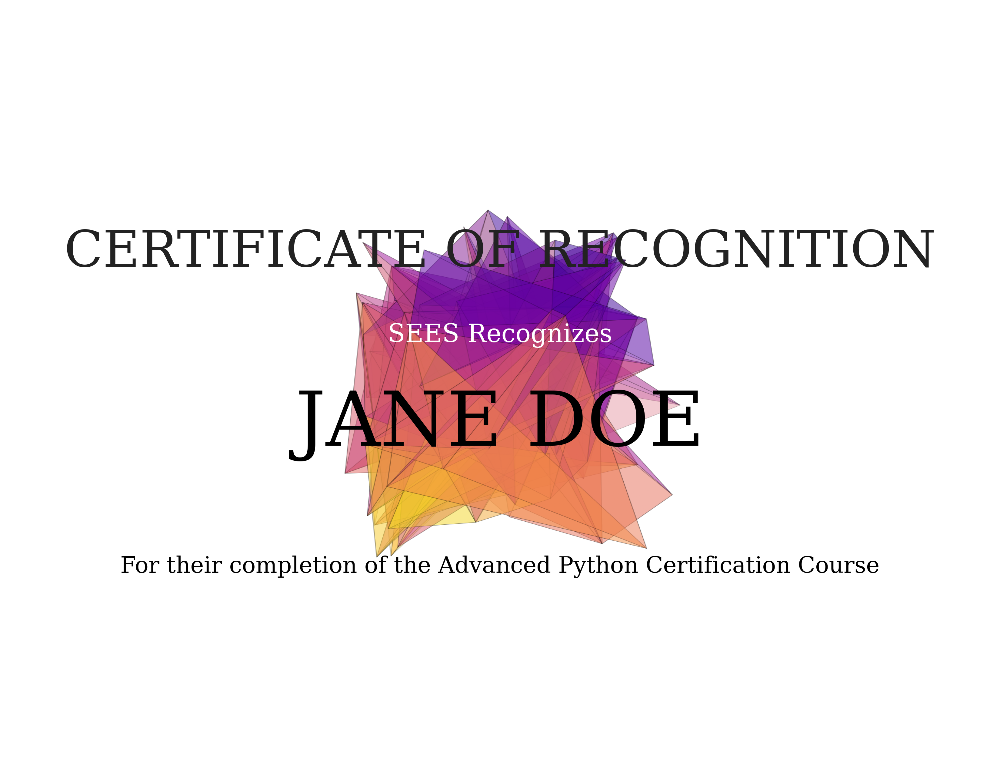

# certGen.py

This is a simple python command line script to generate a certificate. It was
created for the SEES NASA program but can be easily modified to display other
content. A graphic is generated using random Delaunay triangulation to decorate
the certificate.

```
usage: certGen.py [-h] [--user userName] [--level userLevel] [--theme userTheme] [--file usersFile]

Create a SEES python course certificate.

optional arguments:
  -h, --help         show this help message and exit
  --user userName    The name of the student
  --level userLevel  The level of the student
  --theme userTheme  Theme of certificate favicon. Uses matplotlib naming schemes. (default: plasma)
  --file usersFile   Provide a file with respective student names, levels, and themes separated by a newline. (line format: [name] [level] [theme])

Author: hexatedjuice
```
Themes follow the matplotlib naming scheme
[here](https://matplotlib.org/3.2.1/tutorials/colors/colormaps.html). The
default is plasma.

Please format files with `[name] [level] [theme]` per line. The theme parameter
is optional and will default to plasma if left blank. Names are assumed to be
2 words long

`# ./certGen.py --user "jane doe" --level advanced`


